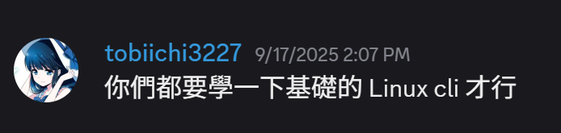

# How to CLI
本repo是基於偉大的[tobiichi](https://github.com/tobiichi3227)教授給予的訓誡，為了讓所有人都學會使用Linux CLI而創立  

  
~~沒有學好Linux CLI可能會在請教問題的時候被tobiichi教授嗆~~

## Basic
- `man <command>` - 查看指令的說明文件
- `<command> --help` or `<command> -h` - 查看指令的簡易說明
- `cd <directory_name>` - 使用相對路徑或絕對路徑切換目錄
- `ls` - 顯示當前目錄的子目錄及檔案
  - `ls <directory_name>` - 顯示指定目錄的子目錄及檔案
  - `ls -a` or `la` - 顯示所有檔案(包含隱藏檔案)
  - `ls -l` or `ll` - 顯示詳細資訊
- `mv <old_name> <new_name>` - 移動或重新命名檔案或目錄
- `cp <source> <destination>` - 複製檔案或目錄
- `rm <file>` - 刪除檔案或目錄。
  - `rm -r <directory_name>` - 刪除目錄及其內容
  - `rm -f <file_name>` - 強制刪除檔案
- `touch <file_name>` - 創建一個新的空檔案或更新檔案的修改時間
- `mkdir <directory_name>` - 創建一個新的目錄。
- `rmdir <directory_name>` - 刪除空目錄。
- `cat <files>` - 顯示檔案內容或將多個檔案串接。
- `pwd` - 顯示當前工作目錄
- `whoami` - 顯示當前使用者名稱
- `grep <pattern> <files>` - 搜尋文本中的字串。
- `find <path> <expression>` - 在檔案系統中搜尋檔案。
- `echo <variable or value>` - 顯示文字或變數的值。
- `<command1> | <command2>` - 管道，將command1的輸出作為command2的輸入
- `<command> > <file>` - 重定向，將command的輸出寫入檔案，覆蓋原有內容
- `<command> >> <file>` - 重定向，將command的輸出附加到檔案末尾
- `<command> < <file>` - 將檔案內容作為command的輸入
- `sudo <command>` - 以root權限執行命令
- `history` - 顯示命令歷史
- `clear` - 清除終端機螢幕

## Editor
- `vim <file_name>` - 使用Vim編輯器打開檔案，詳見[Vim&Neovim教學](./VimNeovim.md)
- `nvim <file_name>` - 使用Neovim編輯器打開檔案，詳見[Vim&Neovim教學](./VimNeovim.md)
