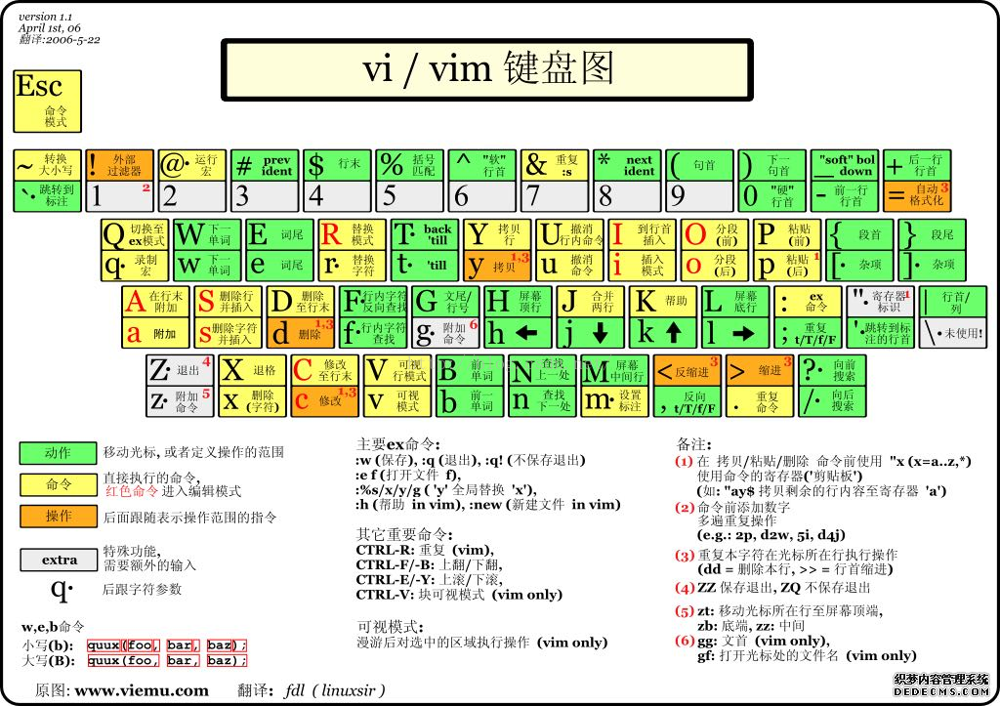

# How to Vim
偉大的tobiichi教授就是Neovim的愛好者，為了讓所有人都學會使用Vim/Neovim而創立本教學


## 基本介紹
Vim 簡單來講就是一個可以在Terminal當中使用的文字編輯器。  
Neovim 是Vim的延伸版本，增加了許多現代化的功能，並且改善了Vim的一些缺點。  

### ~~vim的三大優缺點~~  
1. 你能夠不用滑鼠，但你不能用滑鼠
2. 用久了就會離不開它，但初學者常常無法[離開它](https://stackoverflow.com/questions/11828270/how-do-i-exit-vim)
3. 你幾乎可以config所有東西，但很多東西都要你config
## Vim/Neovim 操作
Vim 和 Neovim的操作基本上相同，以下以Vim為例說明
### 模式
Vim/Neovim 有四種主要模式：
- **普通模式 (Normal mode)**：這是Vim的預設模式，用於移動和執行命令。
- **插入模式 (Insert mode)**：用於編輯文本，可以像普通的文字編輯器一樣輸入文字。
- **命令模式 (Command mode)**：用於輸入命令，如保存文件、退出等。
- **視覺模式 (Visual mode)**：用於選取文本，可以選取字元、行或區塊。
### Keymap

- `<Esc>` or `Ctrl + C` - 切換到普通模式
#### 普通模式
- `h`, `j`, `k`, `l` - 左、下、上、右移動游標
- `0` - 移動到行首
- `$` - 移動到行尾
- `w` - 移動到下一個字的開頭
- `b` - 移動到前一個字的開頭
- `gg` - 移動到文件開頭
- `G` - 移動到文件結尾
- `x` - 刪除當前字元
- `dd` - 刪除當前行
- `yy` - 複製當前行
- `p` - 在游標後貼上
- `u` - 撤銷上一步操作
- `Ctrl + r` - 重做上一步操作
- `v` - 進入視覺模式，選取字元
- `V` - 進入視覺行模式，選取整行
- `:` - 進入命令模式
- `i` - 進入插入模式，在游標前插入
- `I` - 進入插入模式，在行首插入
- `a` - 進入插入模式，在游標後插入
- `A` - 進入插入模式，在行尾插入
- `o` - 在當前行下方插入新行並進入插入模式
- `O` - 在當前行上方插入新行並進入插入模式
#### 命令模式
- `:w` - 保存文件
- `:q` - 退出Vim
- `:wq` - 保存並退出
- `:q!` - 強制退出，不保存更改
#### 視覺模式
- `y` - 複製選取的文本
- `d` - 刪除選取的文本
- `>` - 向右縮排選取的文本
- `<` - 向左縮排選取的文本
## Vim config
Vim 的配置文件是 `~/.vimrc`，使用vimscript語言，基本上網路有很多樣板可以抄，所以在此只提供最基本的。
```vimrc
:set nu " 顯示行號
:set ai " 自動縮排
:set tabstop=4 " 設定tab為4個空格
:set shiftwidth=4 " 設定縮排寬度為4個空格
:set cursorline " 高亮顯示當前行
:set hlsearch " 高亮顯示搜尋結果

" 補全括號等左右批配的字
:inoremap ( ()<ESC>i
:inoremap [ []<ESC>i
:inoremap " ""<ESC>i
:inoremap ' ''<ESC>i
:inoremap {<CR> {<CR>}<ESC>ko
```
## Neovim config
Neovim 的配置文件是 `~/.config/nvim/init.lua`，正常人會使用lua語言來寫(~~你要用vimscript我也不反對，但記得改成init.vim~~)  
這個可以設定的東西太多了，也有很多plugin manger能用(例如偉大的tobiichi教授是使用[lazyvim](https://github.com/folke/lazy.nvim))，所以請各位自己google
